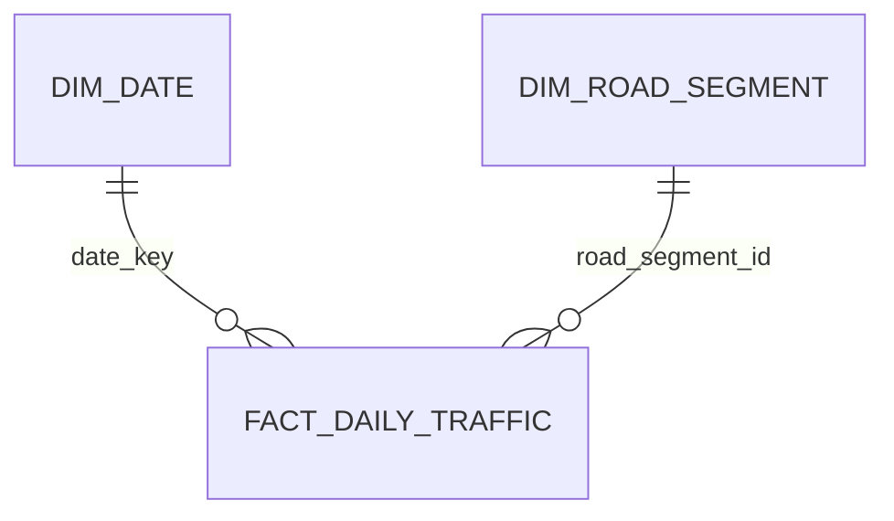

# Lithuania Traffic Analysis

Lietuvos kelių eismo intensyvumo analizės projektas, sukurtas naudojant Python, MySQL ir Power BI.

Projekte apdorojami 2017–2024 m. eismo skaitiklių duomenys, analizuojamas transporto priemonių kiekis, vidutinis greitis, važiavimo kryptys ir intensyviausi kelių ruožai.

> Pastaba: 2017 ir 2024 metų duomenys apima ne visus kalendorinius metus.

## Dashboard

### Eismo apžvalga


### Kelių ruožų analizė


### Greičio analizė


## Projekto tikslai

- Sujungti skirtingų metų eismo duomenų failus.
- Sutvarkyti tarp metų pasikeitusią duomenų struktūrą.
- Patikrinti trūkstamas ir neteisingas reikšmes.
- Sukurti analizei pritaikytą MySQL duomenų modelį.
- Apskaičiuoti svertinį vidutinį greitį.
- Sukurti interaktyvią Power BI ataskaitą.
- Palyginti eismo intensyvumą pagal laiką, kelią, ruožą ir kryptį.

## Naudotos technologijos

- Python
- pandas
- MySQL
- Power BI
- DAX
- Power Query
- Visual Studio Code
- Git

## Duomenų šaltinis

Duomenų šaltinis – oficialūs Lietuvos kelių eismo intensyvumo ir eismo skaitiklių duomenys.

- [Istoriniai eismo duomenys](https://drive.google.com/drive/folders/1ax3iCcHmDli8TXtW0ChwpIvLgktFHF_5)
- [Eismo skaitiklių informacija](https://maps.eismoinfo.lt/portal/apps/sites/#/npp/pages/counters)

Pradiniai CSV ir sugeneruoti duomenų failai į GitHub saugyklą nekeliami dėl jų dydžio. Juos reikia atsisiųsti iš oficialaus šaltinio.

## Duomenų procesas


Python programos:

1. suranda ir patikrina CSV failus;
2. suvienodina skirtingų metų schemas;
3. sujungia metinius eismo duomenis;
4. sutvarko datų, greičio ir kategorijų reikšmes;
5. paruošia kelių ruožų dimensiją;
6. sukuria faktų lentelę importui į MySQL.

Dideli failai apdorojami dalimis, kad būtų efektyviai naudojama kompiuterio atmintis.

## Duomenų modelis

MySQL duomenų bazėje naudojamos lentelės:

- `dim_date` – kalendoriaus dimensija;
- `dim_road_segment` – kelių ir eismo skaitiklių dimensija;
- `fact_traffic` – išsamūs eismo matavimai;
- `agg_daily_road_traffic` – Power BI skirta kasdienė agreguota lentelė.

Power BI modelyje naudojama žvaigždės schema:



## Pagrindiniai rodikliai

Power BI ataskaitoje apskaičiuojami:

- bendras transporto priemonių kiekis;
- svertinis vidutinis greitis;
- analizuojamų kelių ruožų skaičius;
- metinis eismo pokytis;
- vidutinis dienos transporto srautas;
- trūkstamų greičio reikšmių skaičius;
- išskirtinių greičio reikšmių skaičius;
- greičio duomenų kokybės rodikliai.

## Projekto struktūra

```text
lithuania-traffic-analysis/
├── data/
│   ├── raw/
│   └── processed/
├── docs/
│   └── images/
├── powerbi/
│   └── lithuania_traffic_analysis.pbix
├── sql/
├── src/
├── .gitignore
├── requirements.txt
└── README.md
```

## Projekto paleidimas

### 1. Sukurti Python aplinką

```powershell
python -m venv .venv
.venv\Scripts\Activate.ps1
python -m pip install -r requirements.txt
```

### 2. Atsisiųsti duomenis

Atsisiųstus ir išarchyvuotus CSV failus įkelti į:

```text
data/raw/
```

### 3. Paruošti duomenis

Paleisti `src` aplanke esančias Python programas jų numeracijos tvarka.

### 4. Sukurti MySQL modelį

MySQL Workbench programoje paleisti `sql` aplanke esančius failus jų numeracijos tvarka.

Prieš duomenų importą `LOAD DATA LOCAL INFILE` komandose reikia pakeisti `YOUR_USERNAME` į savo Windows vartotojo vardą.

### 5. Atidaryti Power BI ataskaitą

```text
powerbi/lithuania_traffic_analysis.pbix
```

Power BI duomenų šaltinio nustatymuose reikia įvesti savo vietinio MySQL serverio prisijungimo duomenis.

## Duomenų kokybė

Projekte atliekami šie patikrinimai:

- trūkstamų reikšmių analizė;
- datos ir šaltinio metų atitikimo tikrinimas;
- kelių ruožų egzistavimo dimensijoje tikrinimas;
- koordinačių validavimas;
- greičio reikšmių klasifikavimas;
- Python, MySQL ir Power BI rezultatų palyginimas.

## Autorius

Data analytics portfolio project.