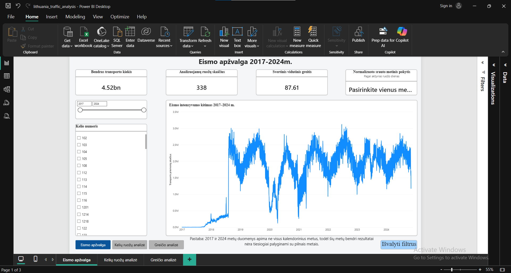
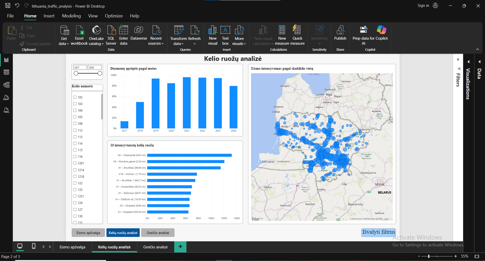
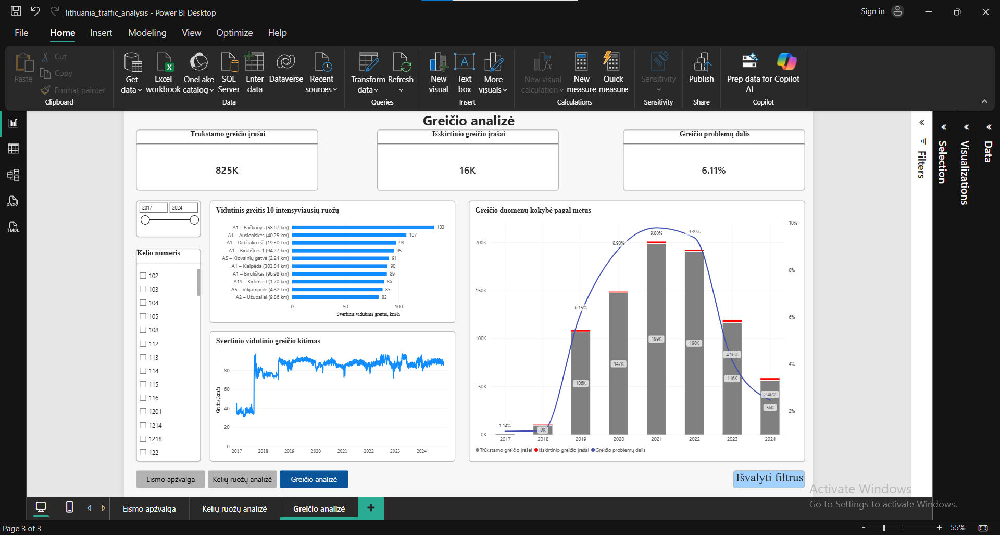
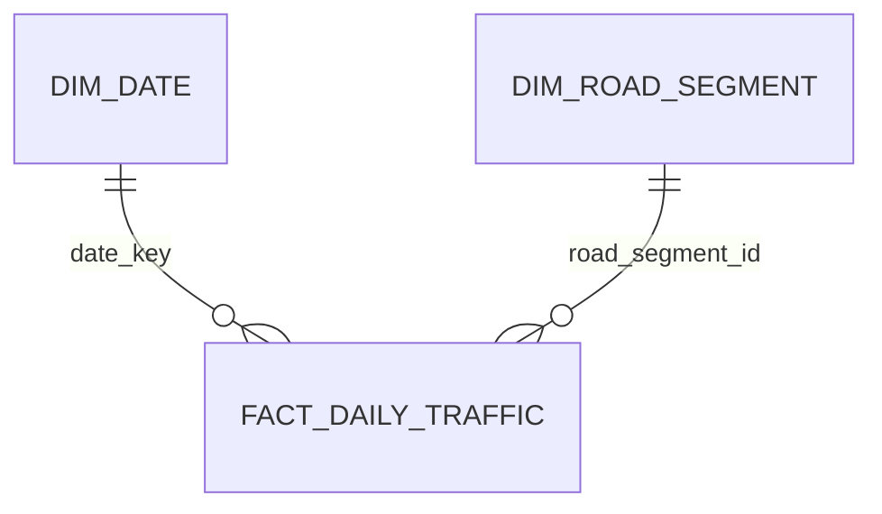

# Lithuania Traffic Analysis

Lietuvos kelių eismo intensyvumo analizės projektas, sukurtas naudojant Python, MySQL ir Power BI.

Projekte apdorojami 2017–2024 m. eismo skaitiklių duomenys, analizuojamas transporto priemonių kiekis, vidutinis greitis, važiavimo kryptys ir intensyviausi kelių ruožai.

> Pastaba: 2017 ir 2024 metų duomenys apima ne visus kalendorinius metus.

## Dashboard

### Eismo apžvalga



### Kelių ruožų analizė



### Greičio analizė



## Projekto tikslai

- Sujungti skirtingų metų eismo duomenų failus.
- Sutvarkyti tarp metų pasikeitusią duomenų struktūrą.
- Patikrinti trūkstamas ir neteisingas reikšmes.
- Sukurti analizei pritaikytą MySQL duomenų modelį.
- Apskaičiuoti svertinį vidutinį greitį.
- Sukurti interaktyvią Power BI ataskaitą.
- Palyginti eismo intensyvumą pagal laiką, kelią, ruožą ir kryptį.

## Naudotos technologijos

- Python
- pandas
- MySQL
- Power BI
- DAX
- Power Query
- Visual Studio Code
- Git

## Duomenų šaltinis

Duomenų šaltinis – oficialūs Lietuvos kelių eismo intensyvumo ir eismo skaitiklių duomenys.

- [Istoriniai eismo duomenys](https://drive.google.com/drive/folders/1ax3iCcHmDli8TXtW0ChwpIvLgktFHF_5)
- [Eismo skaitiklių informacija](https://maps.eismoinfo.lt/portal/apps/sites/#/npp/pages/counters)

Pradiniai CSV ir sugeneruoti duomenų failai į GitHub saugyklą nekeliami dėl jų dydžio. Juos reikia atsisiųsti iš oficialaus šaltinio.

## Duomenų procesas


Python programos:

1. suranda ir patikrina CSV failus;
2. suvienodina skirtingų metų schemas;
3. sujungia metinius eismo duomenis;
4. sutvarko datų, greičio ir kategorijų reikšmes;
5. paruošia kelių ruožų dimensiją;
6. sukuria faktų lentelę importui į MySQL.

Dideli failai apdorojami dalimis, kad būtų efektyviai naudojama kompiuterio atmintis.

## Duomenų modelis

MySQL duomenų bazėje naudojamos lentelės:

- `dim_date` – kalendoriaus dimensija;
- `dim_road_segment` – kelių ir eismo skaitiklių dimensija;
- `fact_traffic` – išsamūs eismo matavimai;
- `agg_daily_road_traffic` – Power BI skirta kasdienė agreguota lentelė.

Power BI modelyje naudojama žvaigždės schema:



## Pagrindiniai rodikliai

Power BI ataskaitoje apskaičiuojami:

- bendras transporto priemonių kiekis;
- svertinis vidutinis greitis;
- analizuojamų kelių ruožų skaičius;
- metinis eismo pokytis;
- vidutinis dienos transporto srautas;
- trūkstamų greičio reikšmių skaičius;
- išskirtinių greičio reikšmių skaičius;
- greičio duomenų kokybės rodikliai.

## Analizės klausimai

1. Kaip 2018–2023 m. keitėsi bendras užfiksuotas transporto kiekis, aktyvių ruožų skaičius ir vidutinis greitis?
2. Ar kiekvienais metais kelių skaitikliai turėjo panašiai pilnus duomenis?
3. Kuriuose kelių ruožuose 2023 m. vidutiniškai per dieną pravažiavo daugiausia transporto priemonių?
4. Kuriuose intensyviuose kelių ruožuose 2023 m. vidutinis greitis buvo mažiausias?
5. Ar krypties laukas gali būti naudojamas realiam nacionalinio eismo pasiskirstymui vertinti?
6. Kiek greičio duomenų kiekvienais metais trūko arba buvo pažymėti kaip neįprasti?
7. Kuriuose kelių ruožuose 2023 m. dienos srautas labiausiai pasikeitė, palyginti su 2022 m.?

## Pagrindinės įžvalgos

### Duomenų aprėptis keičia metinių rezultatų interpretaciją

2019 m. bendras užfiksuotas transporto kiekis buvo 96,73 % didesnis nei 2018 m., tačiau šį skirtumą daugiausia lėmė geresnė duomenų aprėptis. Ji išaugo nuo 49,57 % iki 93,54 %. Normalizavus rezultatus pagal aktyvias kelių ruožų stebėjimo dienas, 2019 m. eismo intensyvumo augimas siekė tik 4,25 %, o ne 96,73 %.

Didžiausias normalizuoto intensyvumo sumažėjimas nustatytas 2020 m. – 20,63 %. Po jo 2021 m. fiksuotas 17,27 %, o 2022 m. – 9,97 % augimas. 2022 m. pasiektas didžiausias analizuoto laikotarpio normalizuotas intensyvumas – 6 673,98 transporto priemonės vienai aktyviai ruožo dienai. 2023 m. rodiklis sumažėjo 2,35 % iki 6 516,81.

2021–2023 m. apskaičiuota aprėptis buvo gana stabili – maždaug 94–96 %, todėl šių metų palyginimai yra patikimesni už 2018–2019 m. bendrų kiekių palyginimą.

### Intensyviausi 2023 m. kelių ruožai

Intensyviausias 2023 m. ruožas buvo A1 kelio Biruliškių skaitiklis ties 96,98 km. Jame vidutiniškai užfiksuota 65 915,51 transporto priemonės per dieną. Antroje vietoje buvo A5 Klovainių gatvės ruožas su 61 037,63, o trečioje – A5 Vilijampolės ruožas su 59 025,01 transporto priemonės per dieną.

Septyni iš dešimties intensyviausių ruožų priklausė A1 keliui. Tai rodo šio kelio dominavimą tarp didžiausią srautą turėjusių 2023 m. stebėjimo vietų, tačiau rezultatas apibūdina tik į duomenų rinkinį įtrauktus skaitiklius, o ne visą Lietuvos kelių tinklą.

### Mažesnio greičio intensyvūs ruožai

Mažiausias svertinis vidutinis greitis tarp 50 intensyviausių 2023 m. ruožų nustatytas A9 Aleksandrijoje – 55,06 km/h, esant 13 086,45 transporto priemonės vidutiniam dienos srautui.

A10 Ąžuolpamūšės ruožas išsiskyrė didesniu 25 313,04 transporto priemonės dienos srautu ir palyginti mažu 64,92 km/h svertiniu vidutiniu greičiu. A14 Didžiosios Riešės ruože vidutinis dienos srautas siekė 20 096,10, o svertinis vidutinis greitis – 72,83 km/h.

Šie ruožai yra kandidatai išsamesniam tyrimui, tačiau mažesnis vidutinis greitis savaime neįrodo spūsčių. Interpretacijai reikėtų valandinių matavimų, greičio ribojimų, kelio tipo ir eismo įvykių informacijos.

### Krypties duomenyse nustatytas struktūrinis disbalansas

2019–2023 m. N kryptis sudarė apie 89–93 % užfiksuoto transporto kiekio, o T kryptis – tik apie 7–11 %. Tokio skirtumo nepaaiškino vien stebėjimo aprėptis: N krypčiai teko apie 53–55 %, o T krypčiai – apie 45–47 % aktyvių ruožo dienų.

Papildoma patikra parodė, kad N kryptis turėjo maždaug 1,7–3 kartus daugiau pradinių eilučių ir gerokai daugiau transporto priemonių vienoje šaltinio eilutėje. Pavyzdžiui, 2023 m. N krypties eilutėje vidutiniškai buvo 318,64, o T krypties – 68,55 transporto priemonės.

Todėl krypties proporcijų negalima interpretuoti kaip realaus nacionalinio eismo pasiskirstymo be papildomos duomenų šaltinio metodikos informacijos. Šis laukas gali būti naudojamas filtravimui ir atskirų skaitiklių tyrimui, tačiau neturėtų būti naudojamas nacionalinei krypčių daliai apibendrinti.

### Greičio duomenų kokybė

Geriausia greičio duomenų kokybė buvo 2018 m., kai trūkstamos arba išskirtinės reikšmės sudarė 1,1605 % pradinių eilučių. Probleminių reikšmių dalis didėjo ir 2021 m. pasiekė 9,8020 %. 2022 m. ji išliko aukšta – 9,3888 %, o 2023 m. sumažėjo iki 4,1588 %.

Išskirtinės greičio reikšmės visais analizuotais metais sudarė tik apie 0,10–0,13 %. Didžiąją greičio kokybės problemų dalį sudarė trūkstamos reikšmės. Dėl to svertinis vidutinis greitis buvo skaičiuojamas tik iš tinkamomis pripažintų greičio reikšmių.

### Didžiausi 2022–2023 m. ruožų pokyčiai

Didžiausias vidutinio dienos srauto padidėjimas nustatytas A10 Ąžuolpamūšės ruože: nuo 9 660,47 transporto priemonės 2022 m. iki 25 313,04 transporto priemonės 2023 m., arba 162,03 %. Kiti dideli padidėjimai nustatyti A4 ruože ties 87,95 km – 54,08 %, ir A5 ruože, kurio skaitiklio ID 1841 – 48,20 %.

Didžiausi sumažėjimai nustatyti A6 Dulių ruože – 35,81 %, kelio Nr. 177 Čeberekų ruože – 34,88 %, A2 Užubalių ruože – 30,98 %, A14 Bulinskių ruože – 28,51 %, ir A1 Kaišiadorių ruože – 26,67 %.

Net ir esant bent 300 dienų duomenų aprėpčiai, labai dideli pokyčiai neturėtų būti automatiškai laikomi vien eismo elgsenos pasikeitimu. Juos galėjo paveikti skaitiklių konfigūracija, kelio darbai, maršrutų pokyčiai arba kiti šiame duomenų rinkinyje nepateikti veiksniai.

## Analizės ribotumai

- 2017 ir 2024 m. duomenys apima ne visus kalendorinius metus, todėl jų bendri kiekiai nėra tiesiogiai lyginami su pilnais metais.
- 2018 m. buvo visų kalendorinių datų duomenų, tačiau apskaičiuota aktyvių ruožo dienų aprėptis siekė tik 49,57 %.
- Aktyvių skaitiklių ir jų stebėjimo dienų skaičius tarp metų skyrėsi, todėl metiniams palyginimams naudojamas normalizuotas rodiklis.
- Krypties duomenyse nustatytas struktūrinis N ir T disbalansas, todėl nacionalinių krypčių proporcijų interpretuoti negalima.
- Vidutinis greitis neparodo paros valandų svyravimų ir savaime neleidžia nustatyti spūsčių.
- Analizė apibūdina duomenų rinkinyje esančias skaitiklių vietas, o ne visą Lietuvos kelių tinklą.
- Analizė nustato statistinius skirtumus, bet neįrodo jų priežasčių.

## Rekomendacijos tolesnei analizei

- Metinius pokyčius vertinti pagal transporto kiekį vienai aktyviai ruožo dienai, o ne vien pagal bendrą užfiksuotą kiekį.
- Atskirai ištirti A10 Ąžuolpamūšės ir kitų didelį 2022–2023 m. pokytį turėjusių ruožų skaitiklių bei kelių istoriją.
- Mažesnio greičio ruožų analizę papildyti greičio ribojimų, kelio tipo ir valandinių matavimų duomenimis.
- Prieš interpretuojant N ir T kryptis gauti išsamesnį duomenų teikėjo paaiškinimą apie krypčių registravimo metodiką.
- Toliau stebėti trūkstamų greičio reikšmių dalį ir ataskaitoje aiškiai rodyti duomenų kokybės rodiklius.


## Projekto struktūra

```text
lithuania-traffic-analysis/
├── data/
│   ├── raw/
│   └── processed/
├── docs/
│   └── images/
├── powerbi/
│   └── lithuania_traffic_analysis.pbix
├── sql/
├── src/
├── .gitignore
├── requirements.txt
└── README.md
```

## Projekto paleidimas

### 1. Sukurti Python aplinką

```powershell
python -m venv .venv
.venv\Scripts\Activate.ps1
python -m pip install -r requirements.txt
```

### 2. Atsisiųsti duomenis

Atsisiųstus ir išarchyvuotus CSV failus įkelti į:

```text
data/raw/
```

### 3. Paruošti duomenis

Paleisti `src` aplanke esančias Python programas jų numeracijos tvarka.

### 4. Sukurti MySQL modelį

MySQL Workbench programoje paleisti `sql` aplanke esančius failus jų numeracijos tvarka.

Prieš duomenų importą `LOAD DATA LOCAL INFILE` komandose reikia pakeisti `YOUR_USERNAME` į savo Windows vartotojo vardą.

### 5. Atidaryti Power BI ataskaitą

```text
powerbi/lithuania_traffic_analysis.pbix
```

Power BI duomenų šaltinio nustatymuose reikia įvesti savo vietinio MySQL serverio prisijungimo duomenis.

## Duomenų kokybė

Projekte atliekami šie patikrinimai:

- trūkstamų reikšmių analizė;
- datos ir šaltinio metų atitikimo tikrinimas;
- kelių ruožų egzistavimo dimensijoje tikrinimas;
- koordinačių validavimas;
- greičio reikšmių klasifikavimas;
- Python, MySQL ir Power BI rezultatų palyginimas.

## Autorius

Data analytics portfolio project.